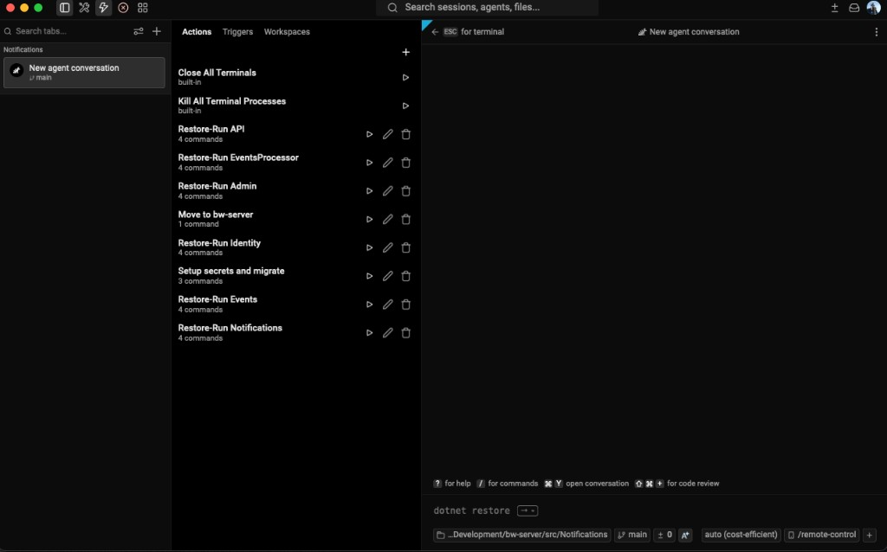
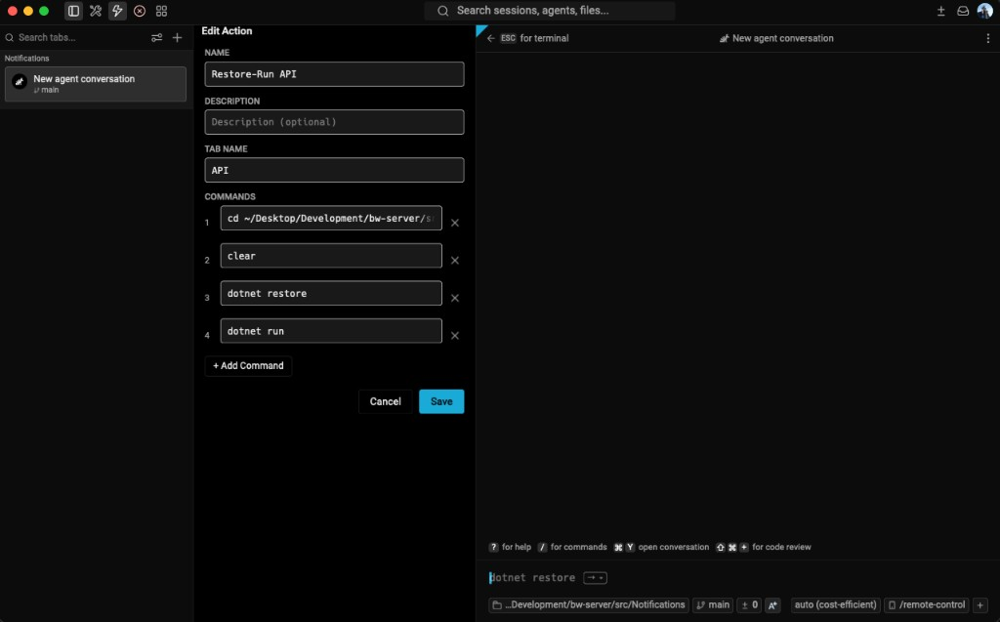
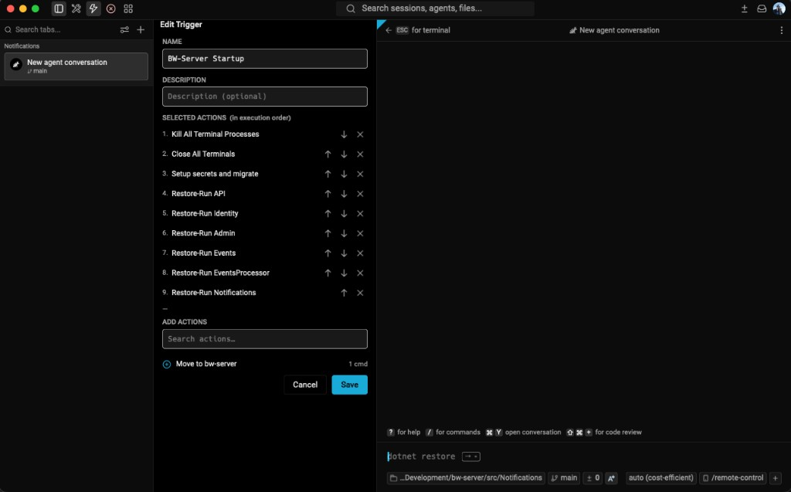
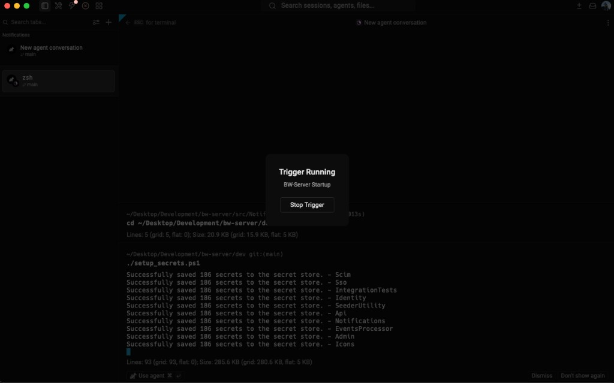

<a href="https://www.warp.dev">
   
</a>

<p align="center">
  <a href="https://www.warp.dev">Website</a>
  ·
  <a href="https://www.warp.dev/code">Code</a>
  ·
  <a href="https://www.warp.dev/agents">Agents</a>
  ·
  <a href="https://www.warp.dev/terminal">Terminal</a>
  ·
  <a href="https://www.warp.dev/drive">Drive</a>
  ·
  <a href="https://docs.warp.dev">Docs</a>
  ·
  <a href="https://www.warp.dev/blog/how-warp-works">How Warp Works</a>
</p>

> [!NOTE]
> OpenAI is the founding sponsor of the new, open-source Warp repository, and the new agentic management workflows are powered by GPT models.

<h1></h1>

## About

[Warp](https://www.warp.dev) is an agentic development environment, born out of the terminal. Use Warp's built-in coding agent, or bring your own CLI agent (Claude Code, Codex, Gemini CLI, and others).

## Actions, Triggers & Workspaces Panel

The **Actions, Triggers & Workspaces** panel is a productivity feature accessible from the toolbar. It provides a single place to author reusable shell automations, chain them into multi-step workflows, and save and restore complete window layouts.

### Actions

**Actions** are named, reusable groups of shell commands. Once defined, an action can be run in the active terminal with a single click, or composed into a trigger to fire multiple actions in sequence.



**Creating and editing actions**

- Open the panel and switch to the **Actions** tab.
- Click the **+** button (or the **Create Action** button shown when the list is empty) to open the inline action editor.
- Fill in:
  - **Name** — a short, human-readable identifier (e.g. `Start Dev Server`).
  - **Description** *(optional)* — extra context shown as secondary text in the list.
  - **Tab Name** *(optional)* — when the action is executed via a trigger, the new terminal tab will be given this name.
  - **Commands** — one or more shell commands, each on its own numbered row. Commands are sent to the terminal in order. Use **+ Add Command** to insert additional rows; click **✕** to remove one.
- Click **Save** to persist the action to `~/.warp/actions/<name>.toml`. Click **Cancel** to discard.
- To edit an existing action, click the **pencil icon** on any action row. The editor opens pre-populated with the saved name, description, tab name, and commands.
- To delete an action, click the **trash icon** on the action row.



> **Built-in actions** — two non-deletable actions are always present at the top of the list:
> - **Close All Terminals** — closes every open terminal tab and leaves one clean tab open.
> - **Kill All Terminal Processes** — sends SIGINT (Ctrl-C) to every running terminal process.

**Running actions**

Click the **play icon** on any action row to immediately send all of its commands to the currently focused terminal pane in sequence.

---

### Triggers

**Triggers** are named, ordered sequences of actions. When a trigger is run, each of its actions is executed in the terminal in the order specified.

**Creating and editing triggers**

- Switch to the **Triggers** tab and click **+** (or **Create Trigger** when the list is empty).
  > If no actions have been defined yet, the create button is hidden and a hint directs you to create an action first. Triggers require at least one action to reference.
- Fill in:
  - **Name** — a label for the trigger (e.g. `Full Deploy`).
  - **Description** *(optional)* — shown as secondary text in the list.
- **Add actions** using the searchable action picker at the bottom of the editor:
  - Type in the search box to filter available actions by name.
  - Click the **+** button next to an action to add it to the trigger's execution list.
  - Added actions appear in the **Selected Actions** section at the top, numbered in execution order.
  - Use the **↑** / **↓** arrow buttons to reorder selected actions.
  - Click **✕** on a selected action to remove it from the trigger.
- Click **Save** to persist the trigger. Click **Cancel** to discard.
- To edit an existing trigger, click the **pencil icon** on a trigger row. The editor opens pre-populated with all fields and the previously selected action order.
- To delete a trigger, click the **trash icon** on the trigger row.



**Running triggers**

Click the **play icon** on a trigger row to start the sequence. Each action opens a **new terminal tab** (named by the action's optional Tab Name) and runs its commands one after the other before moving to the next action.

While a trigger is running:
- The main window is dimmed and non-interactable, with a **"Trigger Running"** card showing the trigger name and a **Stop Trigger** button.
- A badge appears on the Actions & Triggers toolbar icon — clicking it also stops the trigger immediately.



---

### Workspaces

**Workspaces** let you save and restore your entire window layout — every tab, its working directory, its shell type, and its tab kind — so you can switch between projects or pick up exactly where you left off.

**Saving a workspace**

- Switch to the **Workspaces** tab.
- Click the **+** button (or the **Save Workspace** button shown when the list is empty).
- The current layout is captured immediately and the new workspace appears in the list with an auto-generated name (`Workspace YYYY-MM-DD HH:MM`).
- The workspace is persisted to `~/.warp/workspaces/<name>.toml`.

**What is saved per tab**

| Field | Details |
|---|---|
| Custom tab title | Restored verbatim if set |
| Working directory | Restored if the path still exists on disk |
| Shell type | The exact shell that was running — e.g. Windows PowerShell, bash.exe, zsh, a WSL distro, MSYS2, or a Docker sandbox. Falls back to the system default if the shell is no longer available. |
| Tab kind | Regular terminal tabs and **Cloud Oz / Ambient Agent** tabs are both saved and restored to their correct type. |

**Restoring a workspace**

Click the **play icon** next to a saved workspace to restore it. Each saved tab is re-opened as a new tab with its original shell, working directory, and tab type.

**Deleting a workspace**

Click the **trash icon** next to a saved workspace to permanently delete it from disk and remove it from the list.

---

### Storage layout

All panel data is stored as plain TOML files in the user's Warp data directory:

```
~/.warp/
  actions/      # one .toml file per action
  triggers/     # one .toml file per trigger
  workspaces/   # one .toml file per saved workspace
```

Files can be inspected, version-controlled, or shared manually.

### Toolbar Pinning for Actions & Triggers

Any action or trigger can be **pinned to the main toolbar** for one-click access without opening the panel.

**Pinning an action or trigger**

- Open the action or trigger editor (create new or click the pencil icon to edit an existing one).
- At the bottom of the editor, toggle **Pin to toolbar**.
- When enabled, an **icon picker** appears — choose from: Lightning, Play, Refresh, Rocket, Terminal, Folder, Gear, Code, Globe, or Check.
- Save the action or trigger. Its chosen icon now appears as a clickable button directly in the tab bar toolbar.
- Clicking the toolbar button runs the action or trigger immediately, just like clicking play in the panel.

To unpin, re-open the editor, toggle **Pin to toolbar** off, and save.

---

## Tab Groups

Terminal tabs can be organized into **named, collapsible groups** for better session management across projects and workflows.

### Creating and managing groups

**Via right-click context menu (recommended)**

Right-click any tab (in the horizontal tab bar or the left sidebar) and choose:

| Menu item | Effect |
|---|---|
| **Add to New Group** | Creates a new group and adds this tab to it |
| **Add to Group: [name]** | Adds this tab to an existing named group |
| **Remove from Group** | Removes this tab from its current group (tab stays open) |

**Via the sidebar folder button**

When the left sidebar (vertical tabs panel) is open, a **folder icon** appears in the control bar next to the + (new tab) button. Clicking it groups the active tab into a new group, or ungroups it if it is already in a group.

**Via the tab bar folder button**

A matching folder button in the right side of the horizontal tab bar provides the same quick-group / ungroup action for the active tab.

### Visual indicators

- Each tab belonging to a group displays a **2 px colored bottom border** in the group's accent color in the horizontal tab bar.
- In the left sidebar, grouped tabs are **indented with a matching colored left border**, visually connecting them to their group header.
- A colored **section header** (chevron + group name) appears above the first tab of each group in the sidebar.
- Each group is assigned a distinct color automatically from a built-in palette (blue, green, orange, purple, red, cyan, yellow, pink).

### Collapsing and expanding groups (sidebar)

- Click a **group section header** in the left sidebar to collapse all tabs in that group out of view. The chevron changes from ▼ to ▶ to indicate the collapsed state.
- Click the header again to expand the group and reveal its tabs.
- When a group is collapsed and its active tab is hidden, the active tab automatically shifts to the nearest visible tab.

### Renaming groups

- Click the **pencil icon** on the group section header in the sidebar to enter inline rename mode. The group name becomes an editable text field pre-filled with the current name.
- Press **Enter** or click away to commit the new name.
- Press **Escape** to cancel without changes.

### Deleting groups

- Click the **× button** on the group section header in the sidebar to delete the group. All tabs that belonged to it become ungrouped — no tabs are closed.

---


You can [download Warp](https://www.warp.dev/download) and [read our docs](https://docs.warp.dev/) for platform-specific instructions.

## Warp Contributions Overview Dashboard

Explore [build.warp.dev](https://build.warp.dev) to:
- Watch thousands of Oz agents triage issues, write specs, implement changes, and review PRs
- View top contributors and in-flight features
- Track your own issues with GitHub sign-in
- Click into active agent sessions in a web-compiled Warp terminal

## Licensing

Warp's UI framework (the `warpui_core` and `warpui` crates) are licensed under the [MIT license](LICENSE-MIT).

The rest of the code in this repository is licensed under the [AGPL v3](LICENSE-AGPL).

## Open Source & Contributing

Warp's client codebase is open source and lives in this repository. We welcome community contributions and have designed a lightweight workflow to help new contributors get started. For the full contribution flow, read our [CONTRIBUTING.md](CONTRIBUTING.md) guide.

> [!TIP]
> **Chat with contributors and the Warp team** in the [`#oss-contributors`](https://warpcommunity.slack.com/archives/C0B0LM8N4DB) Slack channel — a good place for ad-hoc questions, design discussion, and pairing with maintainers. New here? [Join the Warp Slack community](https://go.warp.dev/join-preview) first, then jump into `#oss-contributors`.

### Issue to PR

Before filing, [search existing issues](https://github.com/warpdotdev/warp/issues?q=is%3Aissue+is%3Aopen+sort%3Areactions-%2B1-desc) for your bug or feature request. If nothing exists, [file an issue](https://github.com/warpdotdev/warp/issues/new/choose) using our templates. Security vulnerabilities should be reported privately as described in [CONTRIBUTING.md](CONTRIBUTING.md#reporting-security-issues).

Once filed, a Warp maintainer reviews the issue and may apply a readiness label: [`ready-to-spec`](https://github.com/warpdotdev/warp/issues?q=is%3Aissue+is%3Aopen+label%3Aready-to-spec) signals the design is open for contributors to spec out, and [`ready-to-implement`](https://github.com/warpdotdev/warp/issues?q=is%3Aissue+is%3Aopen+label%3Aready-to-implement) signals the design is settled and code PRs are welcome. Anyone can pick up a labeled issue — mention **@oss-maintainers** on an issue if you'd like it considered for a readiness label.

### Building the Repo Locally

To build and run Warp from source:

```bash
./script/bootstrap   # platform-specific setup
./script/run         # build and run Warp
./script/presubmit   # fmt, clippy, and tests
```

See [WARP.md](WARP.md) for the full engineering guide, including coding style, testing, and platform-specific notes.

## Joining the Team

Interested in joining the team? See our [open roles](https://www.warp.dev/careers).

## Support and Questions

1. See our [docs](https://docs.warp.dev/) for a comprehensive guide to Warp's features.
2. Join our [Slack Community](https://go.warp.dev/join-preview) to connect with other users and get help from the Warp team — contributors hang out in [`#oss-contributors`](https://warpcommunity.slack.com/archives/C0B0LM8N4DB).
3. Try our [Preview build](https://www.warp.dev/download-preview) to test the latest experimental features.
4. Mention **@oss-maintainers** on any issue to escalate to the team — for example, if you encounter problems with the automated agents.

## Code of Conduct

We ask everyone to be respectful and empathetic. Warp follows the [Code of Conduct](CODE_OF_CONDUCT.md). To report violations, email warp-coc at warp.dev.

## Open Source Dependencies

We'd like to call out a few of the [open source dependencies](https://docs.warp.dev/help/licenses) that have helped Warp to get off the ground:

* [Tokio](https://github.com/tokio-rs/tokio)
* [NuShell](https://github.com/nushell/nushell)
* [Fig Completion Specs](https://github.com/withfig/autocomplete)
* [Warp Server Framework](https://github.com/seanmonstar/warp)
* [Alacritty](https://github.com/alacritty/alacritty)
* [Hyper HTTP library](https://github.com/hyperium/hyper)
* [FontKit](https://github.com/servo/font-kit)
* [Core-foundation](https://github.com/servo/core-foundation-rs)
* [Smol](https://github.com/smol-rs/smol)
